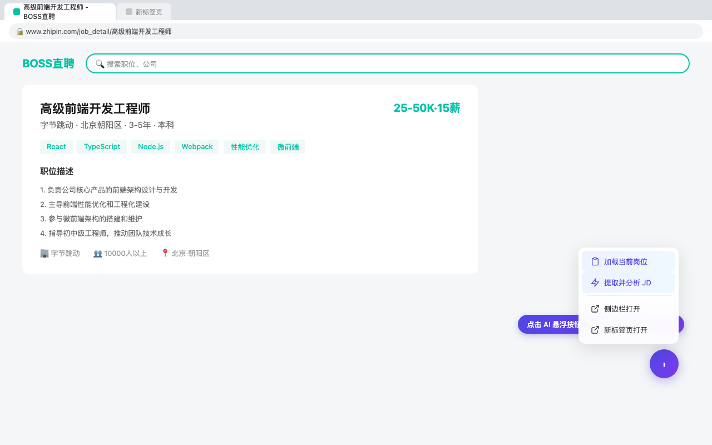
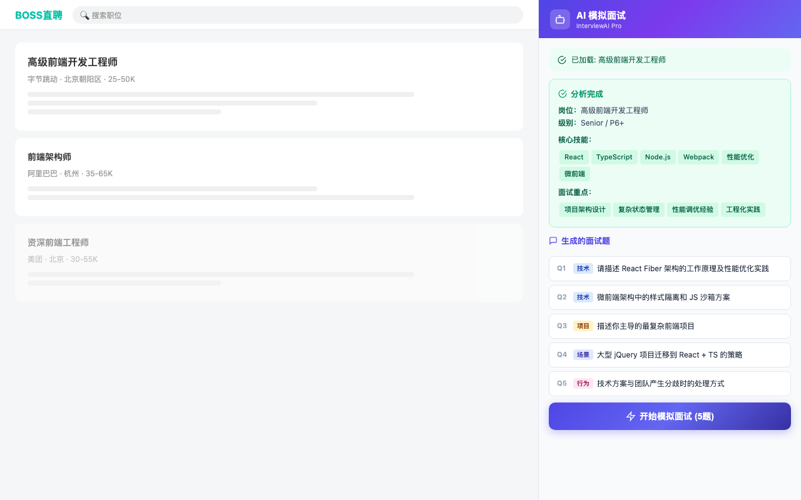
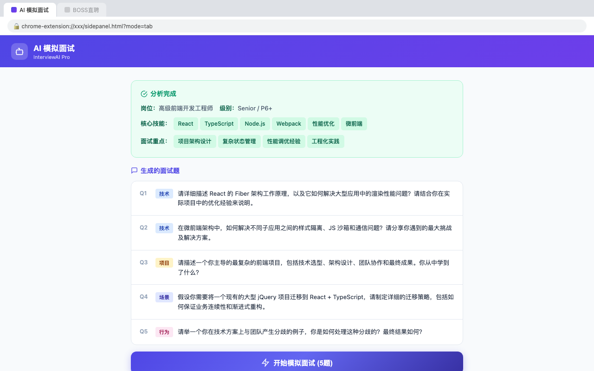
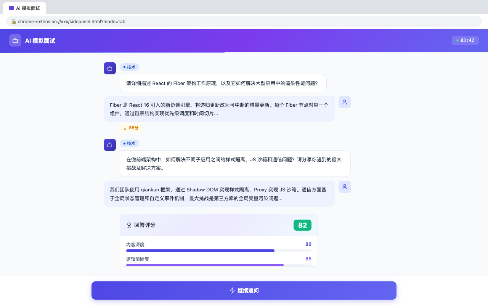
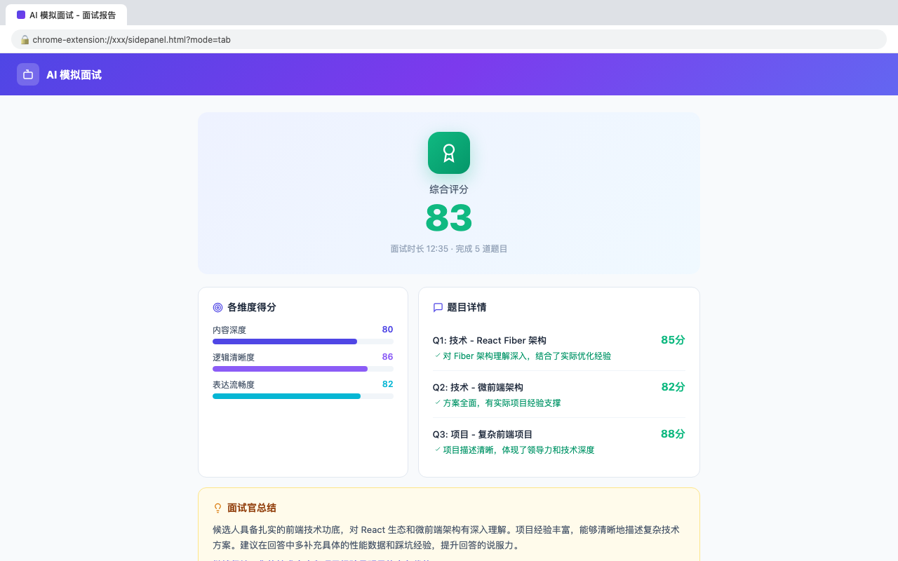

# AI Mock Interview - Interview AI Pro

**[中文文档](README.zh-CN.md)**

> An AI-powered Chrome extension that automatically parses job descriptions from recruitment websites, generates tailored interview questions, simulates real interview sessions, and provides professional scoring feedback.

## Why

Preparing for technical interviews is time-consuming — you need to research the role, guess what questions might come up, and practice answering them. This extension automates the entire process: paste a job link, get a customized mock interview in seconds, and receive actionable feedback to improve your performance.

## Features

**Smart JD Analysis** — Automatically extracts job descriptions from the current page and uses AI to identify core skills, interview focus areas, and difficulty level. Supports **12** major recruitment websites worldwide.

**Custom Question Generation** — Generates 5 interview questions tailored to the role, covering technical depth, project experience, scenario design, and behavioral interview categories. Difficulty adapts to the seniority level.

**Mock Interview Dialogue** — Questions are presented one by one to simulate a real interview pace. The AI interviewer follows up intelligently based on your answers and scores each response in real time.

**Interview Score Report** — Provides an overall score plus multi-dimensional analysis (content depth, logical clarity, expression fluency). Includes per-question feedback, improvement suggestions, and an interviewer summary with readiness assessment.

**Dual Display Modes** — Use the **Side Panel** for a compact view alongside the job page, or open in a **New Tab** for a full-page experience on larger screens.

## Supported Job Sites

| China | International |
|-------|---------------|
| BOSS Zhipin | Indeed |
| Lagou | Glassdoor |
| Zhilian Zhaopin | Wellfound (AngelList) |
| 51job | Dice |
| Liepin | Monster |
| LinkedIn | |
| Nowcoder | |

## Tech Stack

- **Manifest V3** — Latest Chrome extension standard
- **React 18** — Side Panel UI framework
- **esbuild** — Fast bundler
- **Chrome Side Panel API** — Native sidebar integration
- **OpenAI-compatible API** — Works with DeepSeek, Qwen, OpenAI, and more

## Installation

### From Chrome Web Store

> Coming soon.

### Developer Mode (Local Build)

1. Clone and install dependencies:
```bash
git clone https://github.com/mamba-1024/interview-ai.git
cd interview-ai
npm install
```

2. Build the extension:
```bash
npm run build
```

3. Load in Chrome:
   - Navigate to `chrome://extensions/`
   - Enable **Developer mode** (top-right toggle)
   - Click **Load unpacked**
   - Select the `dist/` folder

## Configuration

After installing, open the side panel and go to **Settings** to configure your AI service:

| Field | Description | Example |
|-------|-------------|---------|
| API URL | Your AI provider's endpoint | `https://dashscope.aliyuncs.com/compatible-mode/v1` |
| API Key | Your API key | `sk-xxxxxxxx` |
| Model | Model name | `qwen-turbo` / `deepseek-chat` / `gpt-4o` |

Any OpenAI-compatible API is supported, including but not limited to:

- Alibaba Cloud DashScope (Qwen)
- DeepSeek
- OpenAI (GPT-4o, GPT-4)
- Zhipu GLM
- Self-hosted Ollama

## Quick Start

1. Open any job listing on a supported recruitment website
2. Click the purple AI floating button on the page
3. Select **"Extract & Analyze JD"**
4. Review the AI analysis results and generated questions
5. Click **"Start Mock Interview"** to begin the interview dialogue
6. Complete all questions and view your interview score report

## Project Structure

```
interview-ai/
├── manifest.json          # Extension manifest
├── background.js          # Service Worker (background script)
├── content.js             # Content script (injected into job sites)
├── content.css            # Content script styles (floating button)
├── sidepanel.jsx          # Side Panel main UI (React)
├── sidepanel.html         # Side Panel HTML entry
├── popup.html             # Popup page
├── popup.js               # Popup logic
├── services/
│   ├── ai.js              # AI service wrapper (LLM API calls)
│   ├── jd-parser.js       # Job site JD parsers
│   └── storage.js         # Local storage management
├── sidepanel/styles/
│   └── sidepanel.css      # Side Panel styles
├── icons/                 # Extension icons
├── scripts/
│   ├── build.js           # esbuild build script
│   └── generate-icons.js  # Icon generation script
├── store/                 # Chrome Web Store assets
│   ├── screenshots/       # Store screenshots & promo images
│   ├── privacy-policy.html
│   └── chrome-web-store-listing.md
└── privacy-policy.html    # Privacy policy (hosted on GitHub Pages)
```

## Development

```bash
# Development mode (auto-rebuild on file changes)
npm run dev

# Production build
npm run build

# Regenerate icons
npm run icons
```

Build output is written to the `dist/` directory. Load this folder as an unpacked extension during development.

## Screenshots

<p align="center">
  
  
</p>
<p align="center">
  
  
</p>
<p align="center">
  
</p>

## Privacy

All data (API keys, interview history, settings) is stored **locally** in your browser using `chrome.storage`. The extension does not collect, upload, or share any user data with third-party servers. AI API calls are made directly from your browser to your configured AI provider.

See the full [Privacy Policy](https://mamba-1024.github.io/interview-ai/privacy-policy.html).

## Contributing

Contributions are welcome! Feel free to open an issue or submit a pull request.

## License

[MIT](LICENSE)
